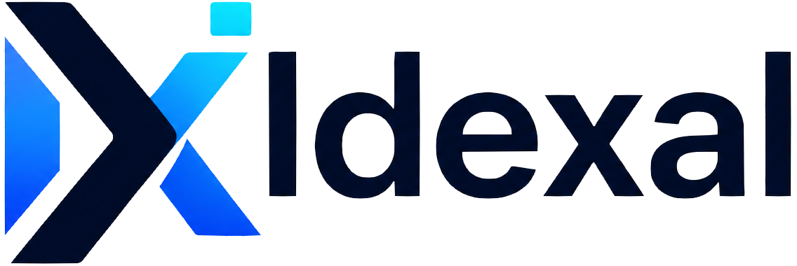

# Idexal

  

  <b>L'espace de travail de développement IA qui continue sans vous.</b>

  <a href="https://idexal.com">idexal.com</a> ·
  <a href="#telechargement">Téléchargement</a> ·
  <a href="CHANGELOG.md">Notes de version</a> ·
  <a href="SUPPORT.md">Assistance</a> ·
  <a href="mailto:contact@idexal.com">contact@idexal.com</a>

  <a href="README.md">English</a> · <a href="README.ar.md">العربية</a> · Français

---

Idexal est un espace de travail commercial de développement assisté par IA. Un
seul moteur d'agent est accessible depuis trois interfaces — application de
bureau, client navigateur et terminal — si bien qu'une session commencée
ailleurs se reprend ailleurs, y compris depuis votre téléphone pendant que votre
machine garde la session vivante.

Ce dépôt est **le canal officiel de téléchargement et de publication**. Il
contient les installateurs, les notes de version et la documentation de mise à
jour. Idexal est un logiciel commercial fermé : le code source est propriétaire
et n'est publié ici ni ailleurs.

## Pourquoi les équipes choisissent Idexal

| | |
|---|---|
| **Trois interfaces, une session** | Bureau, navigateur et terminal partagent le même moteur et le même état de conversation : rien n'est enfermé dans la fenêtre de départ. |
| **Fonctionne sans surveillance, se pilote depuis le téléphone** | Les tâches longues continuent sur votre machine. Le téléphone se branche sur la session existante — il ne démarre pas un second agent. |
| **Votre machine reste la frontière** | Fichiers, terminaux et outils s'exécutent en local. Idexal n'a pas besoin de copier votre dépôt dans un cloud tiers pour être utile. |
| **Extensible par conception** | Compétences, extensions, connecteurs MCP et sous-agents sont des capacités installables de premier ordre, pas des copies du produit. |
| **Pensé pour les équipes multilingues** | L'interface est fournie en arabe (de droite à gauche), en anglais et en français, et s'enrichit version après version. |

## Téléchargement

Les installateurs Windows, macOS et Linux sont publiés sur la
[page des releases](https://github.com/idexal/idexal/releases). Chaque version
indique ses fichiers, les plateformes prises en charge, les sommes de contrôle et
les changements apportés.

| Plateforme | Installateur | Architecture |
| --- | --- | --- |
| Windows | `Idexal-Setup-<version>.exe` (assistant d'installation guidé) | x64 |
| macOS | `Idexal-<version>.dmg` | Apple Silicon, Intel |
| Linux | `Idexal-<version>.AppImage`, `.deb` | x64, arm64 |

Chaque version publie une somme SHA-256 à côté de ses fichiers. Vérifiez-la
avant d'installer.

### Canaux de publication

| Canal | Signification | Pour vous si |
| --- | --- | --- |
| **Alpha** | Accès anticipé. Les fonctions marchent mais la surface évolue encore ; les limites connues sont documentées. | Vous voulez la nouveauté et acceptez des cassures. |
| **Beta** | Périmètre figé. Installateur, mise à jour et retour arrière testés sur chaque plateforme supportée. | Vous voulez les nouveautés juste avant la disponibilité générale. |
| **Stable** | Version prise en charge. Correctifs de sécurité et régressions traités sur cette ligne. | Un usage quotidien en production. |
| **LTS** | Une ligne Stable maintenue pendant une période étendue. | Les équipes qui figent une version avec un engagement long. |

Le canal figure dans le titre de la version, à côté du numéro, par exemple
`Idexal 4.0.0 · Alpha`. Les numéros suivent `MAJOR.MINOR.PATCH` ; un canal ne
change jamais la signification d'un numéro.

### Mise à jour

Idexal interroge son canal tout seul et vous signale une version plus récente.
**Rien n'est téléchargé ni installé sans votre accord** — le téléchargement et
l'installation automatiques sont une option que vous activez, pas un comportement
par défaut.

| Comportement | Par défaut |
| --- | --- |
| Vérifier une version plus récente | Activé |
| Télécharger sans demander | **Désactivé** — vous acceptez d'abord |
| Installer | Après le téléchargement, quand vous choisissez d'appliquer |
| Sessions, espaces de travail, identifiants et réglages | Préservés lors de la mise à jour |

Sous Windows, appliquer une mise à jour reste toujours un choix explicite. Sous
macOS et Linux, une fois acceptée, elle est appliquée à la fermeture. Pour revenir
en arrière, installez la version précédente depuis cette page ; ni la mise à jour
ni le retour arrière ne suppriment vos données.

## Documentation

| Document | Contenu |
| --- | --- |
| [CHANGELOG.md](CHANGELOG.md) | Historique des versions : ce qui change, ce qui est vérifié, ce qui reste ouvert |
| [SECURITY.md](SECURITY.md) | Comment signaler une vulnérabilité et comment nous la traitons |
| [SUPPORT.md](SUPPORT.md) | Où obtenir de l'aide, et quoi joindre à un signalement |
| [THIRD-PARTY-NOTICES.md](THIRD-PARTY-NOTICES.md) | Composants tiers, licences et mentions de copyright |
| [LICENSE](LICENSE) | Termes de la licence commerciale Idexal |

## Contact

Questions commerciales, déploiement et partenariats : <contact@idexal.com>.
Problèmes d'usage et demandes de fonctionnalités :
[GitHub Issues](https://github.com/idexal/idexal/issues).
